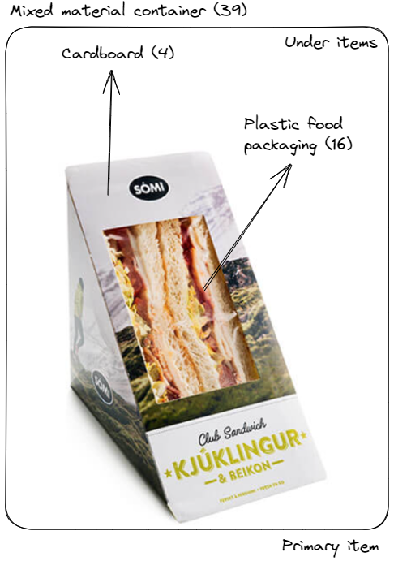
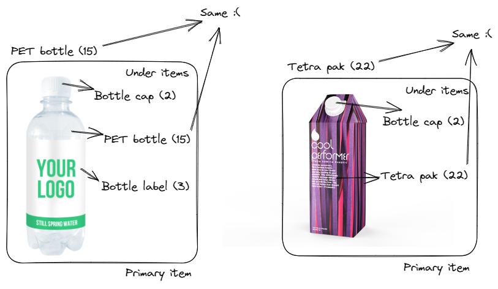

# Reykjavik university trash dataset collection code
Code for collecting pictures of trash with an insanely detailed encoding scheme for research purposes

| Parameter          | Description                                              | Parameter values                          | Purpose                                  |
|--------------------|----------------------------------------------------------|-------------------------------------------|------------------------------------------|
| id                 | ID of the picture                                        | 1-N                                       | To name the file names after the ID      |
| dc                 | Date of when a garbage bag was collected                 | DDMMYY                                    | To create visualizations of what trash goes where        |
| t	                 | Timestamp	                                            | YYYY-MM-DD HH:MM:SS	                    | To record the exact time when a trash item was collected |
| n                  | Name of collector                                        | Name                                      | To know who is responsible for taking the pictures and collecting the info  |
| li                 | Lighting                                                 | 0: No lighting   1: Lighting inside bin   2: Lighting inside and outside bin | To know the lighting conditions, 2 is if there is also light outside coming into the identification chamber       |
| o                  | Bin origin                                               | 0: Plastic bin   1: Paper bin   2: General bin   3: Cans bin   4: Unknown | Describing what waste stream the trash item came from (it can be correct or incorrect)                 |
| l                  | location                                                 | 0: Sólinn, 1: Jörðinn, 2: Either, 3: Unknown | From what location in HR the trash was collected from (feel free to change it based on your location) |
| ct	             | Country	                                                | Country name                              | To identify the country where the trash is collected     |
| mu	             | Municipality	                                            | Municipality name or code	                | To identify the municipality where the trash is collected |
| mrf	             | MRF Facility	                                            | MRF facility name or code	                | To identify the Material Recovery  Facility where the trash is processed |
| s                  | Sample number                                            | 1-N | To be able to take multiple pictures of the same object instance and number each instance |
| wt	             | Weight	                                                | 0: Not specified or unmeasurable   Other number: The weight	                        | To provide information about the weight of the trash items in total in grams |
| pi                 | Primary item count                                       | 1-N                                       | Counting primary items                                   |
| c                  | Composite                                                | 0: Not composite, 1: Composite            | To know if a trash item is not composed of just one material       |
| cl                 | Item type                                                | 00: Aluminum cans   01: Bleached paper   02: Bottle cap   03: Bottle labels   04: Cardboard   05: Empty   06: Hand   07: HDPE bottle   08: Ice cream wrappers   09: Lids   10: Metallized film   11: Paper cups   12: Paper plastic composite   13: Paper straw   14: Paper tissues   15: PET bottle   16: Plastic food packaging   17: Plastic wrapper   18: Recycled cardboard   19: Smoothie bottle   20: Snus container   21: Sticky notes   22: Tetra pak   23: Unbleached paper   24: Electronics   25: Plastic cutlery   26: Plastic straws   27: Plastic bags   28: Polystyrene foam   29: Windowed envelopes   30: Books notebooks   31: Magazines   32: Glass jars   33: Broken glass   34: Food waste   35: Textiles   36: Wood   37: Rubber   38: Gum   39: Mixed material container   40: Food wrap   41: Paper bags   42: Metallic cutlery   43: Ear plugs   44: Paper wrap   45: Nicotine pouches   46: Paper container   47: Paper lid   48: Cupcake liners   49: Receipts   50: Compostable tray   51: Bleached paper              | Identifying item type                                    |
| sh	             | Shape of the object	                                    | 0: Not applicable or unknown   1: Cylindrical   2: Rectangular   3: Spherical   4: Cuboidal   5: Conical   6: Prismatic   7: Toroidal   8: Irregular   9: Flat   10: Tubular of the trash items | For research purposes, can be indicative of material composition |
| p                  | Partial object                                           | 0: Not partial   1: Quarter partial   2: Half partial   3: Three quarters partial | Describing object's partiality             |
| d                  | Dirtiness                                                | 0: No dirtiness   1: Partial dirtiness   2: Some dirtiness   3: A lot of dirtiness | Describing dirtiness (contamination) level (subjective)   |
| sd	             | Source of dirtiness	                                    | 0: None   1: Food   2: Liquids   3: Chemicals   4: Other	                               | To identify the source of dirtiness of the trash items |
| re	             | Recyclable or not	                                    | 0: Not recyclable   1: Recyclable   2: Unknown                                                                         | To indicate if the item is recyclable given the waste management from where the trash is collected (this is an educated guess somewhat)                 |
| rc	             | Recycling code	                                        | 0: No recycling code   Other number: Recycling code   Multiple: multiple recycling codes    | To know if there's a recycling code on the product and what number it is                  |
| md	             | Minimizing Dirtiness                                 	| Text	                                   | To provide guidelines or best practices on how to minimize or avoid contamination for each trash item |
| de                 | Deformation                                              | 0: Not deformed   1: Partially deformed   2: Somewhat deformed   3: Very deformed | Describing deformation level (subjective)  |
| u                  | Unopened                                                 | 0: Opened container   1: Unopened container | Indicating if a container is unopened               |
| co                 | Compostable                                              | 0: Uncertain   1: Not compostable   2: Compostable | Indicating if the item is compostable         |
| coc                | Compostability code                                      | 0: None   Else: The code (in numbers) | Gives the compostability code of the item                 |
|bi	                 | Biodegradable	                                        | 0: Not biodegradable   1: Biodegradable   2: Unknown	| To indicate if the item is biodegradable |
| ba                 | Barcode                                                  | 0: None   Else: The code (in numbers) | Gives the barcode of the item                             |
| m                  | Metal type                                               | 0: Not metal   1: Aluminum metal   2: Steel   3: Copper | Identifying metal type            |
| g                  | Glass color                                              | 0: Not glass   1: Transparent   2: Red   3: Green | Describing glass color                  |
| pc                 | PET or HDPE color                                        | 0: Not PET or HDPE   1: Transparent   2: Red   3: Green | To know if the PET bottle can be processed or not      |
| pl                 | PET or HDPE label                                        | 0: Not PET or HDPE bottle   1: No label   2: Covers half   3: Covers third fourths, 4: Full sleeve | To know if the PET bottle can be processed or not            |
| pt                 | Plastic type                                             | 0: Not plastic or not only or not sure, 1: PET   2: PE-HD   3: PVC   4: PE-LD   5: PP   6: PS   7: Other | Identifying plastic type |
| b                  | Brand                                                    | Various brands or "NO_BRAND"             | Identifying brand                        |
| pr                 | Product                                                  | Various products or "NO_PRODUCT"         | Identifying product                      |
| w                  | Waste stream                                             | 0: Plastic bin   1: Paper bin   2: General bin   3: Cans bin   4: Unknown        | Identifying product                                    |
| ui                 | Under item count                                         | 0-N                                      | Counting under items for a primary item  |
| des                | Description of decomposition                             | 0: None   Else: Description           | Giving instructions on how to correctly decompose the object to display on the bin screen, only relevant if the under types for a primary object have different item types which go into different waste streams |                     
| sus                  | If there's anything suspect                        | NO: 0: There's nothing   Else: Description                                | Any commentary on if there is something that is unclear or weird                              |

There are a couple of important things to keep in mind:
1. If there are multiple primary items, they all have individual encodings and can have either none or multiple under items. When parsing the encoding you can separate each primary item by knowing how many there are, this is also true for the under items.
2. The reason for having primary and under items, is to know when there are different items which should go into different waste streams, if this is the case, then they should always go into the general category. Therefore, when there are multiple primary items, they go into the "multiple_items" folder which was made to make a neural network model which can identify if there are object which share the same waste stream or not, and to identify if there are multiple objects.

There is a little bit of a problem where the under item is the same as the primary item. However, from my understanding it doesn't seem to be much of an issue in these cases:

The item types were first created to anticipate what trash items would be collected from the waste at HR, but overtime it grew organically based on the trash that I saw when I was collecting, so it is always changing.

When collecting data using this encoding, it is assumed that you manually type in the information about the item before inserting it into an "identification chamber", not afterwards.

I've thought about adding a UI and/or a program in which a photo pops up and you have to insert metadata about it, but I haven't gotten around to it.

